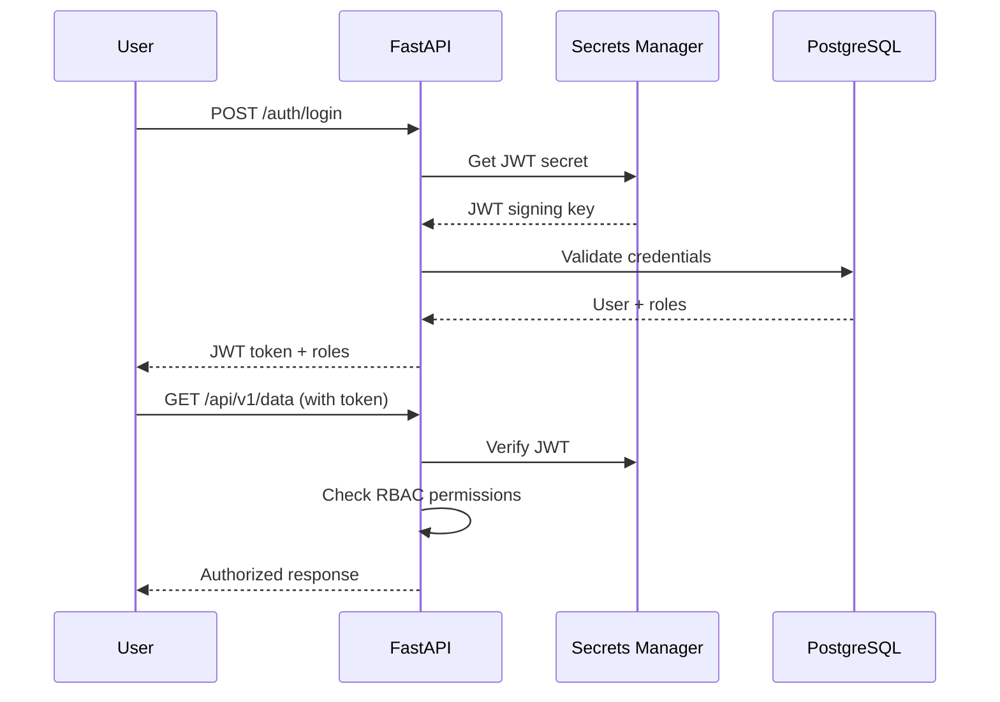
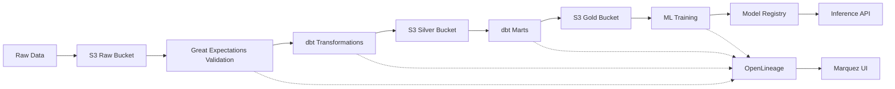

# Clinical Data Platform - Cloud Deployment Guide

## 🚀 Overview

The clinical data platform has been upgraded from a local-only system to a **production-ready, cloud-native platform** with enterprise-grade security, scalability, and compliance features.

## ✨ Key Features

### 🏗️ **Infrastructure as Code**
- **Terraform**: Complete AWS infrastructure definition
- **Auto-scaling**: ECS Fargate with load balancing
- **Multi-environment**: Dev, staging, and production configurations
- **Cost-optimized**: Minimal footprint with smart defaults

### 🔐 **Security & Compliance**
- **JWT Authentication**: Role-based access control (RBAC)
- **AWS Secrets Manager**: No hardcoded secrets
- **PHI Redaction**: HIPAA Safe Harbor compliance
- **Audit Logging**: Complete request tracing
- **Read-only Mode**: GxP compliance support

### 📊 **Data Platform**
- **Data Lake**: S3 buckets for raw/silver/gold data
- **Data Validation**: Great Expectations with automated quality gates
- **Data Lineage**: OpenLineage integration with Marquez
- **Version Control**: DVC for data and model versioning

### 🔄 **CI/CD Pipeline**
- **GitHub Actions**: Automated testing and deployment
- **Security Scanning**: Vulnerability detection and secrets scanning
- **Quality Gates**: 85% test coverage requirement
- **Blue-green Deployment**: Zero-downtime deployments

### 📈 **Observability**
- **Prometheus Metrics**: Custom application and infrastructure metrics
- **Grafana Dashboards**: Real-time monitoring and alerting
- **Distributed Tracing**: Request correlation across services
- **Log Aggregation**: Centralized logging with PHI scrubbing

## 🚀 Quick Start

### Prerequisites
```bash
# Required tools
aws configure  # AWS credentials
terraform --version  # >= 1.0
docker --version
poetry --version
```

### 1. Infrastructure Deployment
```bash
# Initialize and deploy infrastructure
make infra.init
make infra.plan
make infra.apply

# Bootstrap secrets
make secrets.bootstrap
```

### 2. Application Deployment
```bash
# Build and push containers
make docker.build

# Deploy via GitHub Actions (push to main) or manual:
make deploy
```

### 3. Access Your Platform
```bash
# Get API URL
cd infra/terraform && terraform output api_url

# Test the deployment
curl $(terraform output -raw api_url)/health

# Access monitoring
echo "Grafana: http://grafana.clinical-platform-dev.internal:3000"
echo "Prometheus: http://prometheus.clinical-platform-dev.internal:9090"
```

## 📁 Project Structure

```
clinical-data-platform/
├── infra/terraform/          # Infrastructure as Code
│   ├── main.tf              # VPC, networking, core resources
│   ├── ecs.tf               # ECS services and task definitions  
│   ├── rds.tf               # PostgreSQL database
│   ├── s3.tf                # Data lake buckets
│   ├── secrets.tf           # AWS Secrets Manager
│   ├── iam.tf               # IAM roles and policies
│   └── outputs.tf           # Infrastructure outputs
├── .github/workflows/        # CI/CD pipelines
│   ├── ci.yml               # Testing and validation
│   └── deploy.yml           # Infrastructure deployment
├── docker/                  # Container definitions
│   ├── api.Dockerfile       # FastAPI application
│   ├── dbt.Dockerfile       # dbt runner
│   └── worker.Dockerfile    # ML/batch processing
├── api/                     # FastAPI application
│   ├── auth.py              # JWT authentication & RBAC
│   ├── dependencies.py     # Security dependencies
│   ├── config.py            # Cloud configuration
│   ├── telemetry.py         # Metrics and monitoring
│   └── routers/             # API endpoints
├── observability/           # Monitoring configuration
│   ├── dashboards/          # Grafana dashboards
│   └── alerts/              # Alerting rules
├── mlops/                   # ML operations
│   ├── dvc.yaml             # Data version control pipeline
│   └── params.yaml          # ML parameters
├── scripts/                 # Automation scripts
│   └── bootstrap_cloud.sh   # Cloud secrets setup
└── docs/                    # Documentation
    └── data_card.md         # Data governance and compliance
```

## 🛡️ Security Architecture

### Authentication Flow


### Role-Based Permissions
| Role | Data Access | Model Training | Admin Functions |
|------|-------------|----------------|-----------------|
| `admin` | ✅ Full | ✅ Yes | ✅ Yes |
| `analyst` | ✅ Read/Write | ✅ Yes | ❌ No |
| `researcher` | ✅ Read/Analyze | ✅ Yes | ❌ No |
| `bi_readonly` | ✅ Read Only | ❌ No | ❌ No |
| `clinician` | ✅ Patient Data | ❌ No | ❌ No |

## 📊 Data Pipeline Architecture

### Data Flow


### Data Contracts
```yaml
# Great Expectations Suite Example
expectations:
  - expectation_type: expect_table_row_count_to_be_between
    kwargs:
      min_value: 1000
      max_value: 10000
  
  - expectation_type: expect_column_values_to_not_be_null
    kwargs:
      column: patient_id
      
  - expectation_type: expect_column_values_to_be_unique
    kwargs:
      column: patient_id
      
  - expectation_type: expect_column_values_to_be_in_set
    kwargs:
      column: gender
      value_set: ["M", "F", "Other"]
```

## 🔄 CI/CD Pipeline

### Pipeline Stages
1. **Code Quality**: Linting, type checking, security analysis
2. **Testing**: Unit tests with 85% coverage requirement
3. **Data Validation**: dbt tests and Great Expectations
4. **Container Security**: Vulnerability scanning with Trivy
5. **Infrastructure**: Terraform plan and apply
6. **Deployment**: ECS service updates with health checks
7. **Smoke Tests**: End-to-end validation

### GitHub Secrets Required
```bash
# Add to repository settings -> Secrets and variables -> Actions
AWS_ROLE_ARN=arn:aws:iam::ACCOUNT:role/clinical-platform-dev-github-actions
AWS_REGION=us-east-1
ECR_REGISTRY=ACCOUNT.dkr.ecr.us-east-1.amazonaws.com
```

## 📈 Monitoring & Observability

### Key Metrics
- **API Performance**: Request rate, latency percentiles, error rates
- **Data Quality**: Validation failures, processing times
- **Infrastructure**: CPU/memory usage, database connections
- **Security**: Failed authentication attempts, PHI redaction events

### Alerting Rules
```yaml
# Example Prometheus alerting rules
groups:
  - name: clinical-platform
    rules:
      - alert: HighErrorRate
        expr: rate(http_requests_total{status_code=~"5.."}[5m]) > 0.05
        for: 5m
        annotations:
          summary: "High error rate detected"
          
      - alert: DatabaseConnectionsHigh
        expr: database_connections_active > 80
        for: 2m
        annotations:
          summary: "Database connection pool near capacity"
```

### Grafana Dashboards
- **API Overview**: Request rates, response times, error rates
- **Data Pipeline**: dbt run status, validation results
- **Infrastructure**: ECS task health, database performance
- **Security**: Authentication events, PHI redaction stats

## 💰 Cost Optimization

### Default Configuration (Dev Environment)
| Resource | Instance Type | Monthly Cost |
|----------|---------------|--------------|
| RDS PostgreSQL | db.t3.micro | ~$13 |
| ECS Tasks | 256 CPU, 512 MB | ~$10 |
| S3 Storage | Standard tier | ~$2 |
| CloudWatch Logs | 7-day retention | ~$3 |
| **Total** | | **~$30/month** |

### Cost Controls
- **Lifecycle Policies**: Automatic S3 archiving to Glacier
- **Right-sizing**: Minimal compute resources for dev/staging
- **Auto-scaling**: Scale to zero during off-hours
- **Reserved Instances**: Cost savings for production workloads

## 🔧 Operations Guide

### Deployment Commands
```bash
# Local development
make demo-local          # Complete local setup
make api.dev            # Start API locally
make status             # Check system health

# Cloud deployment  
make demo-cloud         # Deploy everything to AWS
make infra.apply        # Update infrastructure
make logs.api           # View application logs

# Maintenance
make check              # Run all quality checks
make security           # Security analysis
make clean              # Clean up artifacts
```

### Troubleshooting
```bash
# Check infrastructure status
terraform output

# View ECS service logs
aws logs tail /ecs/clinical-platform-dev --follow

# Check secrets
aws secretsmanager list-secrets --query 'SecretList[?contains(Name, `clinical-platform`)]'

# Test API health
curl $(terraform output -raw api_url)/health

# Check database connectivity
aws ecs run-task --cluster clinical-platform-dev-cluster \
  --task-definition clinical-platform-dev-api:1 \
  --overrides '{"containerOverrides":[{"name":"api","command":["python","-c","import psycopg2; print(\"DB OK\")"]}]}'
```

## 📋 Compliance & Governance

### HIPAA Compliance
- **De-identification**: Automated Safe Harbor method implementation
- **Audit Logging**: Complete request tracing with PHI scrubbing
- **Access Controls**: Role-based permissions with least privilege
- **Data Encryption**: At rest (S3, RDS) and in transit (TLS)

### Data Governance
- **Data Classification**: Public, Internal, Confidential, Restricted
- **Retention Policies**: Automated lifecycle management
- **Consent Management**: Patient consent tracking and enforcement
- **Lineage Tracking**: Complete data provenance with OpenLineage

### Quality Assurance
- **Data Validation**: Great Expectations quality gates
- **Code Quality**: 85% test coverage, security scanning
- **Performance**: SLA monitoring and alerting
- **Disaster Recovery**: Automated backups and recovery procedures

## 🚀 Next Steps

### Phase 2 Enhancements
- [ ] **Multi-region Deployment**: Global data replication
- [ ] **Advanced ML**: AutoML pipelines and A/B testing
- [ ] **Real-time Streaming**: Kafka/Kinesis integration
- [ ] **Advanced Security**: WAF, DDoS protection, SIEM integration

### Phase 3 Scale-out
- [ ] **Microservices**: Service mesh with Istio
- [ ] **Data Mesh**: Federated data governance
- [ ] **Edge Computing**: Regional data processing
- [ ] **AI/ML Platform**: Comprehensive MLOps with Kubeflow

## 📞 Support

- **Documentation**: [docs/](docs/)
- **Issues**: Create GitHub issues for bugs and feature requests
- **Security**: Report security issues to security@clinical-platform.com
- **Compliance**: Contact compliance@clinical-platform.com for regulatory questions

---

**🎉 Congratulations!** Your clinical data platform is now production-ready with enterprise-grade security, scalability, and compliance features. The platform can handle real clinical data workloads while maintaining the highest standards of data protection and regulatory compliance.