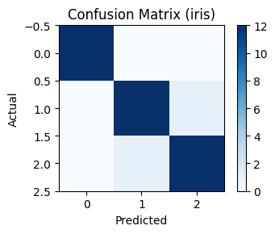

# Clinical Data Platform

[](https://github.com/altalanta/clinical-data-platform/actions/workflows/ci.yml)
[](https://github.com/altalanta/clinical-data-platform/actions/workflows/codeql.yml)
[](https://github.com/altalanta/clinical-data-platform/actions/workflows/docker.yml)
[](https://codecov.io/gh/altalanta/clinical-data-platform)
[](https://altalanta.github.io/clinical-data-platform/)
[](https://github.com/altalanta/clinical-data-platform/actions/workflows/validation-good.yml)
[](https://github.com/altalanta/clinical-data-platform/actions/workflows/validation-bad.yml)
[](https://github.com/altalanta/clinical-data-platform/actions/workflows/compliance.yml)

Local-first clinical data platform: ingest → transform (dbt/DuckDB) → validate → ML → API/UI.

- **Docs:** https://altalanta.github.io/clinical-data-platform/
- **Container:** `ghcr.io/altalanta/clinical-data-platform`
- **Pre-commit:** `pip install pre-commit && pre-commit install`

## 🚀 One-click Demo

Try the platform instantly with **synthetic data** (no PHI, fully offline):

[](https://codespaces.new/altalanta/clinical-data-platform?quickstart=1)
[](https://colab.research.google.com/github/altalanta/clinical-data-platform/blob/main/notebooks/public_demo_quickstart.ipynb)

**Quick local setup:**
```bash
git clone https://github.com/altalanta/clinical-data-platform.git
cd clinical-data-platform
make fetch-public
make demo-public
open artifacts/public_demo/README.md
```

**What you get:**
- 🎲 Synthetic OMOP CDM data (persons, visits, conditions, measurements)
- ✅ Data quality validation with Great Expectations + Pandera  
- 📊 Analytics-ready dbt transformations in DuckDB
- 📋 Comprehensive data docs and quality reports
- 🔒 Zero PHI - safe for public demos and development

## GxP/HIPAA Read-Only Mode

This repo includes a **read-only mode** and **PHI-safe logging**:

- Read-only mode blocks `POST/PUT/PATCH/DELETE` when `READ_ONLY_MODE=1`.
- Scrubbed logging removes PHI and omits sensitive keys when `LOG_SCRUB_VALUES=1` (automatically enabled in read-only mode).
- Structured logs use a `PHIFilter` plus `python-json-logger` to avoid raw values reaching sinks.

**Run API in read-only mode:**
```bash
make api.readonly
# curl -i -X POST http://localhost:8000/predict  # -> 403
```

**Unit tests (redaction pipeline):**
```bash
make test.compliance
```

- Logging config reference: `config/logging/read_only.yaml`
- CI status: [](https://github.com/altalanta/clinical-data-platform/actions/workflows/compliance.yml)

## Data Gatekeeping (Great Expectations + pandera)

This project keeps both pandera and Great Expectations side-by-side to gate data quality. The suite **fails** on the known-bad seed (`visits.csv`) and **passes** once the outlier is corrected (`visits_good.csv`).

**Local:**
```bash
# Fails (bad data: one cost > 500)
make validate.bad

# Passes (fixed data)
make validate.good
```

- CI (good dataset): [](https://github.com/altalanta/clinical-data-platform/actions/workflows/validation-good.yml)
- CI (bad dataset – expected to fail on `ci/ge-bad-demo` or manual dispatch): [](https://github.com/altalanta/clinical-data-platform/actions/workflows/validation-bad.yml)
- Artifacts land in `docs/assets/demo/validation/` (`summary_*.json`, `ge_result_*.json`).

## Demo (screenshots & artifacts)

- **dbt artifacts:** [`docs/assets/demo/dbt/`](docs/assets/demo/dbt/)
- **Star schema snapshot:** 
- **MLflow metrics:**  · [`metrics.json`](docs/assets/demo/mlflow/metrics.json)
- **API (captured curl outputs):** [`curl_health.txt`](docs/assets/demo/api/curl_health.txt) · [`curl_predict.json`](docs/assets/demo/api/curl_predict.json)
- **Quick GIF:** 

Run locally:
```bash
make demo
# (optional) run API for live curl
uvicorn clinical_data_platform.api:app --reload
curl -s http://localhost:8000/health
curl -s -X POST http://localhost:8000/predict -H 'Content-Type: application/json' -d '{"features":[5.1,3.5,1.4,0.2]}'
```

Production-quality sample project demonstrating an end-to-end clinical data platform: ingest → validate/standardize (SDTM-like) → warehouse (star schema) → dbt transforms → analytics + ML → dashboard + API. Cloud-ready (AWS-first) while runnable locally without external credentials using DuckDB + MinIO + local MLflow.

- Language: Python 3.11
- Storage/Compute: DuckDB, Parquet, (mocked) S3 via MinIO
- Transform: pandas/polars, dbt-duckdb
- Validation: pandera + Great Expectations
- ML: scikit-learn + MLflow
- API/UI: FastAPI + Streamlit
- Orchestration (optional, local only): Prefect
- CI/CD: GitHub Actions (lint/type/test/security/coverage, build Docker, docs)

## Quickstart

Prereqs: Docker, Docker Compose, Python 3.11, Poetry.

- make setup — create virtualenv, install deps, install pre-commit
- make data — generate tiny synthetic SDTM-like CSVs (DM/AE/LB/VS/EX)
- make minio — start MinIO + seed buckets
- make ingest — land→bronze→silver (Parquet) with logging + lineage
- make dbt — run dbt models + tests against DuckDB
- make analytics — run curated analytics queries into `data/analytics/`
- make train — train a simple ML model and log to MLflow
- make api — run FastAPI on http://localhost:8000
- make ui — run Streamlit on http://localhost:8501
- make demo — end-to-end local pipeline, then open dashboard

Everything runs locally by default; no external credentials required. To switch to AWS later, adjust `configs/config.aws.yaml` and env vars (see `.env.example`).

## Observability

- pip install -r requirements.txt — install local instrumentation dependencies
- make obsv.up — start OpenTelemetry collector, Loki, Tempo, Grafana (admin/admin)
- make obsv.demo — run ingest/dbt/train demos + compute silver freshness SLI
- Dashboard: Grafana → Observability/Clinical Pipeline Observability (throughput, latency, errors, traces, freshness)
- Logs land in Loki; traces in Tempo; alerts provisioned via `observability/rules/freshness_slo.yaml`
- Freshness SLO: silver data updated within 120 minutes (tunable via `--slo-minutes`); outputs to `observability/freshness_sli.json`
- Runbook: [ops/runbook.md](ops/runbook.md) details triage when the SLO breaches

## Mapping to the Job Description

- Design and implement data models (SQL + dbt)
  - `sql/warehouse_ddl.sql`, `dbt/clinical_dbt/`, `src/clinical_platform/warehouse/`
- Data engineering + analytics for clinical trials
  - `src/clinical_platform/ingestion/`, `standards/`, `validation/`, `analytics/`
- Python, SQL, data modeling
  - Python code across `src/`, SQL in `sql/`, dbt models/tests in `dbt/`
- AWS (mocked locally) + CI/CD
  - MinIO S3 mocks (`docker-compose.yml`), `s3_client.py`, GitHub Actions in `.github/workflows/`
- Clean code + tests
  - `ruff`, `black`, `mypy`, `pytest` (+ coverage ≥85%), `bandit`, pre-commit hooks
- Clinical standards (CDISC SDTM/ADaM)
  - `standards/cdisc_sdtm_mapping.py`, `standards/sdtm_schemas/*.json`, `standards/adam/build_adsl.py`
- Dashboards and ML
  - `ui/dashboard.py` (Streamlit), `ml/train.py`, `ml/infer.py`, `ml/registry.py`
- Security/compliance awareness (GxP/HIPAA/GDPR)
  - `security/phi_redaction.py`, `configs/logging.yaml`, `docs/compliance.md`, IAM doc

## Local Configuration

- Configs: `configs/config.local.yaml` (default) and `configs/config.aws.yaml` (cloud)
- Logging: `configs/logging.yaml` (JSON logs; avoids data values by default)
- Env vars: `.env.example` lists toggles for local vs cloud and secrets for MinIO

## One-command Demo

`make demo` runs: data generation → start MinIO → ingest bronze→silver → dbt → analytics → train ML → launch API + dashboard.

## Troubleshooting

- DuckDB/Parquet: Ensure read/write permissions in `data/`
- MinIO fails to start: Ports 9000/9001 in use. Stop other services or change ports.
- dbt errors: Verify `dbt/profiles.yml.example` copied to `~/.dbt/profiles.yml` or set `DBT_PROFILES_DIR`.
- MLflow UI empty: Set `MLFLOW_TRACKING_URI` to `http://localhost:5000` (docker) or use local file `mlruns/` default.

## Contributing & SDLC

- Conventional commits; pre-commit hooks enforce format/lint
- CI: lint + typecheck + tests + coverage gate (>=85%) + bandit + docker build
- Docs: MkDocs Material + Mermaid, published via GitHub Pages

## License

MIT
