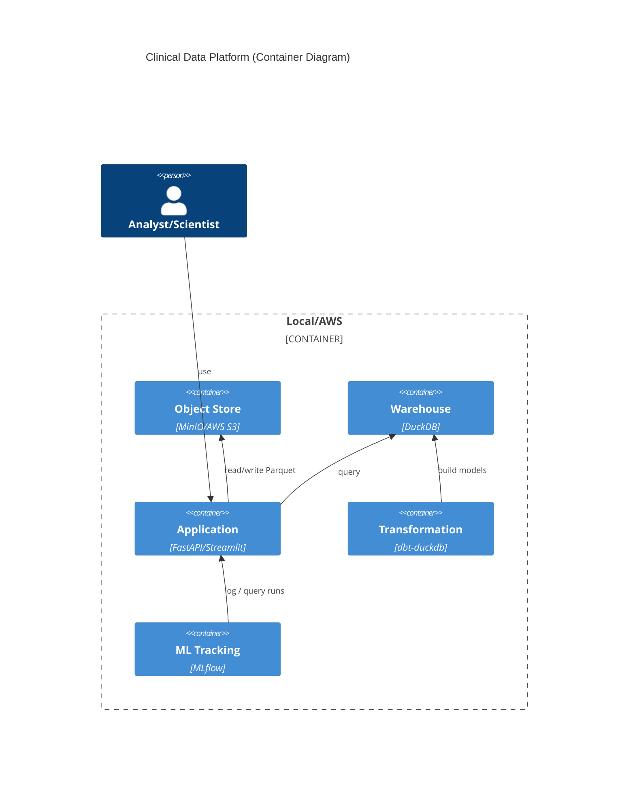

# Architecture

```mermaid
flowchart LR
  A[Raw CSV (SDTM-like)] -->|ingest_csv.py| B[(MinIO S3 - raw)]
  B -->|parquet-ize| C[(MinIO S3 - bronze)]
  C -->|cdisc_sdtm_mapping| D[(MinIO S3 - silver)]
  D -->|loaders.py| E[(DuckDB Warehouse)]
  E -->|dbt| F[(Marts)]
  F -->|queries.py| G[Analytics Outputs]
  F --> H[API]
  F --> I[Dashboard]
  D --> J[ML Features]
  J --> K[ML Training/Scoring]
```

## C4 (Container Level)



