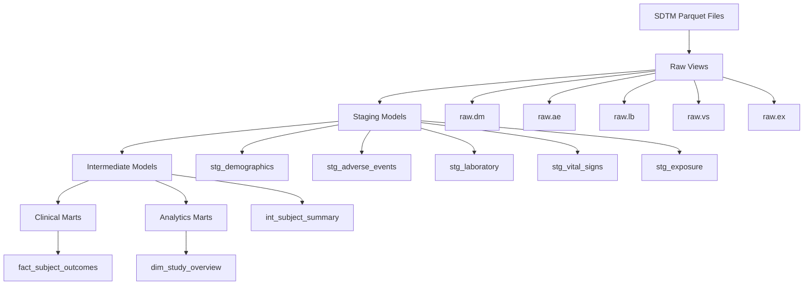

# Clinical Data Platform - dbt Project

Production-ready dbt project for transforming clinical trial data from SDTM sources into analytics-ready data marts.

## 📋 Project Overview

This dbt project implements a modern data warehouse architecture for clinical data:

- **Raw Layer**: External views reading SDTM Parquet files
- **Staging Layer**: Cleaned and standardized data with business logic
- **Intermediate Layer**: Combined datasets with calculated metrics
- **Marts Layer**: Final business tables for analytics and reporting

## 🚀 Quick Start

### Prerequisites

- DuckDB
- dbt-duckdb adapter
- Python 3.11+

### Setup

1. **Copy profiles template**:
   ```bash
   cp profiles.yml.example ~/.dbt/profiles.yml
   # Or set DBT_PROFILES_DIR=dbt
   ```

2. **Install dependencies**:
   ```bash
   dbt deps --project-dir dbt/clinical_dbt
   ```

3. **Run the project**:
   ```bash
   DBT_PROFILES_DIR=dbt dbt build --project-dir dbt/clinical_dbt
   ```

## 📁 Project Structure

```
dbt/clinical_dbt/
├── dbt_project.yml          # Project configuration
├── packages.yml              # dbt package dependencies
├── profiles.yml.example      # Connection profiles template
├── models/
│   ├── sources.yml           # Source definitions and tests
│   ├── staging/              # Staging models (views)
│   │   ├── stg_demographics.sql
│   │   ├── stg_adverse_events.sql
│   │   ├── stg_laboratory.sql
│   │   ├── stg_vital_signs.sql
│   │   └── stg_exposure.sql
│   ├── intermediate/         # Intermediate models (views)
│   │   └── int_subject_summary.sql
│   └── marts/               # Final business tables
│       ├── clinical/        # Clinical data marts
│       │   └── fact_subject_outcomes.sql
│       ├── analytics/       # Analytics data marts
│       │   └── dim_study_overview.sql
│       └── schema.yml       # Model tests and documentation
├── macros/
│   └── clinical_utils.sql   # Clinical-specific utility macros
├── seeds/                   # Static reference data (if needed)
├── snapshots/              # Slowly changing dimensions
├── tests/                  # Custom data tests
└── analysis/               # Ad-hoc analysis queries
```

## 🔄 Data Flow



## 🏗️ Model Layers

### Raw Layer (`raw.*`)
External views reading directly from SDTM Parquet files:
- `raw.dm` - Demographics
- `raw.ae` - Adverse Events
- `raw.lb` - Laboratory
- `raw.vs` - Vital Signs
- `raw.ex` - Exposure

### Staging Layer (`staging.*`)
Cleaned and standardized data with:
- Data type conversions
- Standardized naming
- Basic derived fields
- Data quality flags

### Intermediate Layer (`intermediate.*`)
Business logic and aggregations:
- Subject-level summaries
- Cross-domain calculations
- Derived clinical indicators

### Marts Layer (`*_marts.*`)
Production-ready business tables:
- **Clinical Marts**: Subject-focused fact tables
- **Analytics Marts**: Study-level aggregations

## 🧪 Testing Strategy

### Source Tests
- Column existence and uniqueness
- Referential integrity
- Value range validations
- Data freshness checks

### Model Tests
- Business logic validation
- Data quality assertions
- Cross-table consistency
- Performance benchmarks

### Custom Tests
- Clinical-specific validations
- SDTM compliance checks
- Safety signal detection

## 📊 Key Models

### `fact_subject_outcomes`
Primary fact table containing subject-level clinical outcomes:
- Demographics and treatment assignment
- Adverse event summaries and safety metrics
- Laboratory and vital signs aggregations
- Data completeness indicators
- Clinical risk categorization

**Key Metrics**:
- `total_adverse_events`
- `serious_adverse_events`
- `abnormal_lab_rate`
- `safety_risk_category`
- `data_completeness_score`

### `dim_study_overview`
Study-level summary for executive reporting:
- Enrollment and demographics statistics
- Safety profile assessment
- Data quality metrics
- Treatment exposure summaries

## 🔧 Configuration

### Environment Variables
```bash
# DuckDB connection
DUCKDB_PATH=data/warehouse.duckdb
DUCKDB_THREADS=4
DUCKDB_MEMORY_LIMIT=2GB

# Study configuration
STUDY_ID=STUDY001
STUDY_NAME="Clinical Data Platform Demo Study"

# Data quality thresholds
COMPLETENESS_THRESHOLD=0.95
AGE_MIN=0
AGE_MAX=150
```

### dbt Variables
Set in `dbt_project.yml` or override via command line:
```yaml
vars:
  study_id: 'STUDY001'
  study_name: 'Clinical Data Platform Demo Study'
  completeness_threshold: 0.95
  age_min: 0
  age_max: 150
```

## 🛠️ Development Workflow

### Local Development
```bash
# Run specific model
dbt run --models stg_demographics --project-dir dbt/clinical_dbt

# Test specific model
dbt test --models fact_subject_outcomes --project-dir dbt/clinical_dbt

# Generate documentation
dbt docs generate --project-dir dbt/clinical_dbt
dbt docs serve --project-dir dbt/clinical_dbt
```

### Full Build
```bash
# Complete build with tests
dbt build --project-dir dbt/clinical_dbt

# Build specific tag
dbt build --models tag:staging --project-dir dbt/clinical_dbt
```

### CI/CD Integration
```bash
# Run in CI environment
dbt build --project-dir dbt/clinical_dbt --target test

# Generate artifacts for documentation
dbt docs generate --project-dir dbt/clinical_dbt --target prod
```

## 📝 Macros and Utilities

### Clinical Utility Macros
- `categorize_age()` - Standardized age grouping
- `flag_abnormal_vital()` - Vital signs clinical flagging
- `safety_risk_category()` - AE risk categorization
- `lab_result_flag()` - Laboratory result interpretation
- `audit_fields()` - Standard audit field generation

### Data Quality Macros
- `data_completeness_score()` - Calculate completeness metrics
- `clinical_profile_category()` - Subject risk profiling
- `phi_safe_concat()` - PHI-safe field concatenation

## 🔍 Data Quality

### Built-in Validations
- SDTM domain compliance
- Cross-domain referential integrity
- Clinical value range checks
- Data completeness monitoring

### Custom Great Expectations
- Laboratory normal range validation
- Vital signs physiological limits
- Adverse event severity consistency
- Treatment exposure logic

## 📚 Documentation

### Model Documentation
Each model includes:
- Business purpose and usage
- Column descriptions and data types
- Data lineage and dependencies
- Known limitations and assumptions

### Generate Documentation
```bash
dbt docs generate --project-dir dbt/clinical_dbt
dbt docs serve --project-dir dbt/clinical_dbt --port 8080
```

## 🚨 Troubleshooting

### Common Issues

1. **DuckDB Memory Errors**:
   ```bash
   # Increase memory limit
   export DUCKDB_MEMORY_LIMIT=4GB
   ```

2. **Missing Source Data**:
   ```bash
   # Verify parquet files exist
   ls data/sample_standardized/
   ```

3. **Test Failures**:
   ```bash
   # Run tests with detailed output
   dbt test --store-failures --project-dir dbt/clinical_dbt
   ```

4. **Performance Issues**:
   ```bash
   # Run with threads optimization
   dbt run --threads 8 --project-dir dbt/clinical_dbt
   ```

### Debug Commands
```bash
# Debug connection
dbt debug --project-dir dbt/clinical_dbt

# Compile without running
dbt compile --project-dir dbt/clinical_dbt

# Show model dependencies
dbt ls --models +fact_subject_outcomes+ --project-dir dbt/clinical_dbt
```

## 🎯 Best Practices

### Model Development
- Use descriptive model names with prefixes (`stg_`, `int_`, `fact_`, `dim_`)
- Include comprehensive tests for all business-critical models
- Document all clinical logic and assumptions
- Use consistent naming conventions across all models

### Performance Optimization
- Minimize data scanning with appropriate filtering
- Use views for staging, tables for marts
- Leverage DuckDB's columnar storage efficiently
- Monitor query performance with `--log-level debug`

### Data Security
- Never log PHI in model descriptions
- Use macros for PHI-safe transformations
- Implement data masking for non-production environments
- Follow clinical data handling best practices

## 📞 Support

For questions about this dbt project:
- Check model documentation: `dbt docs serve`
- Review test results: `dbt test --store-failures`
- Validate configuration: `dbt debug`