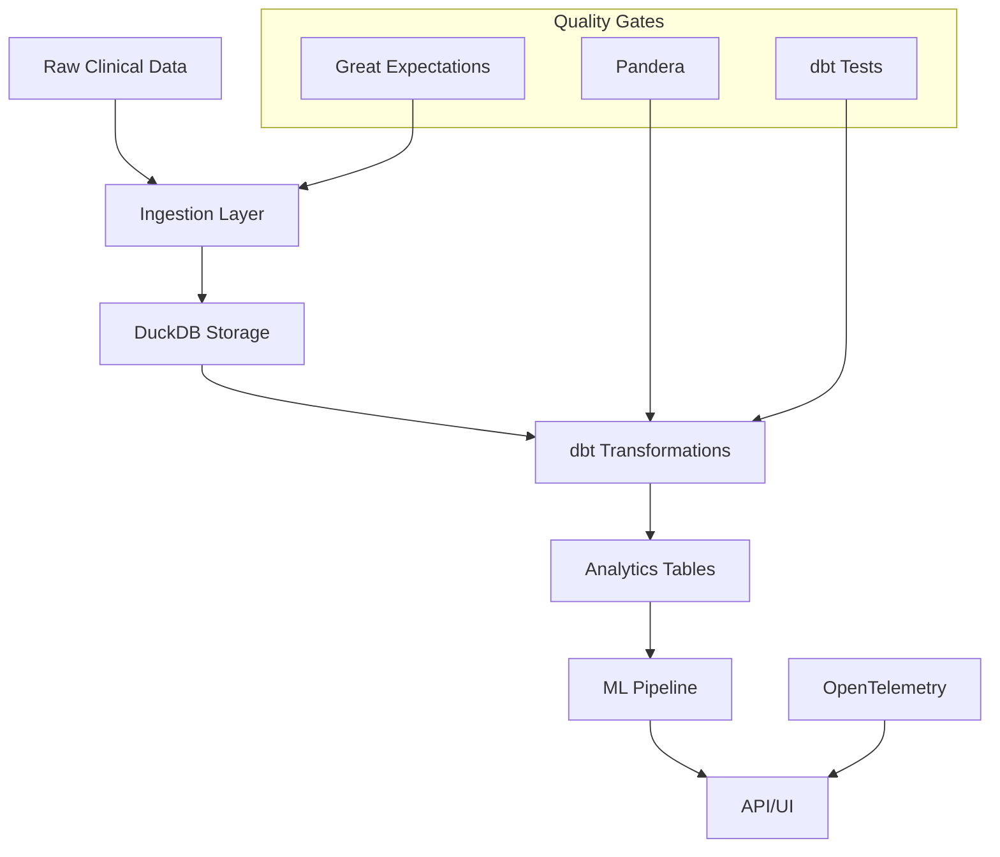
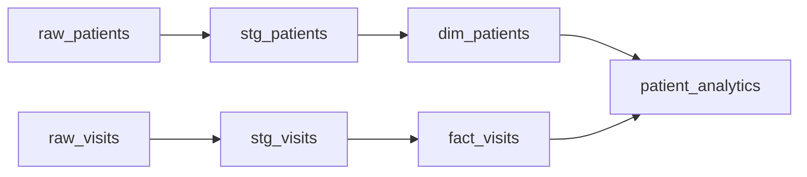

# Data Flow

This page describes how data moves through the Clinical Data Platform, from ingestion to final outputs.

## Overview

The platform follows a modern ELT (Extract-Load-Transform) pattern optimized for analytical workloads:



## 1. Ingestion Layer

### Data Sources
- **OMOP CDM**: Common Data Model for observational health data
- **CSV/Parquet**: Structured clinical datasets
- **HL7 FHIR**: Healthcare interoperability standard
- **Synthetic Data**: Generated for testing and demos

### Validation
All incoming data is validated using Great Expectations:

```python
# Example expectation suite
{
    "expectation_type": "expect_table_row_count_to_be_between",
    "kwargs": {"min_value": 1000, "max_value": 100000}
},
{
    "expectation_type": "expect_column_values_to_not_be_null", 
    "kwargs": {"column": "person_id"}
}
```

### Storage
- **Raw Layer**: Original data as ingested
- **Staging Layer**: Cleaned and standardized
- **Marts Layer**: Business-ready analytical tables

## 2. Transformation (dbt)

The platform uses dbt for SQL-based transformations:

### Model Structure
```
models/
├── staging/          # Clean and standardize
│   ├── _sources.yml
│   └── stg_patients.sql
├── intermediate/     # Business logic
│   └── int_patient_visits.sql
└── marts/           # Final analytics tables
    ├── dim_patients.sql
    └── fact_visits.sql
```

### Key Features
- **Incremental models** for large datasets
- **Snapshot tables** for slowly changing dimensions
- **Data tests** for quality assurance
- **Documentation** with descriptions and lineage

### Example Model
```sql
-- models/marts/dim_patients.sql
{{ config(materialized='table') }}

select
    person_id,
    gender_concept_id,
    year_of_birth,
    race_concept_id,
    ethnicity_concept_id,
    current_timestamp as _loaded_at
from {{ ref('stg_patients') }}
where person_id is not null

-- Test: Every patient should have a unique ID
{{ test_unique('person_id') }}
```

## 3. Quality Assurance

### dbt Tests
Built-in and custom tests ensure data quality:

```yaml
# models/schema.yml
models:
  - name: dim_patients
    description: Patient dimension table
    columns:
      - name: person_id
        description: Unique patient identifier
        tests:
          - unique
          - not_null
      - name: year_of_birth
        tests:
          - dbt_expectations.expect_column_values_to_be_between:
              min_value: 1900
              max_value: 2023
```

### Pandera Schema Validation
Python-based schema validation for DataFrames:

```python
import pandera as pa

patient_schema = pa.DataFrameSchema({
    "person_id": pa.Column(int, checks=pa.Check.gt(0)),
    "gender_concept_id": pa.Column(int, nullable=True),
    "year_of_birth": pa.Column(int, checks=pa.Check.in_range(1900, 2023)),
})

@pa.check_types
def process_patients(df: pa.typing.DataFrame[patient_schema]) -> pa.typing.DataFrame:
    return df.dropna(subset=['person_id'])
```

## 4. Machine Learning Pipeline

### Feature Engineering
- **Temporal features**: Visit patterns, medication adherence
- **Clinical features**: Diagnoses, procedures, lab values
- **Demographic features**: Age groups, geographic regions

### Model Training
```python
from sklearn.ensemble import RandomForestClassifier
from sklearn.model_selection import train_test_split

# Feature selection and engineering
features = engineer_features(clinical_data)
X_train, X_test, y_train, y_test = train_test_split(features, target)

# Model training with cross-validation
model = RandomForestClassifier(n_estimators=100, random_state=42)
model.fit(X_train, y_train)

# Evaluation and metrics
accuracy = model.score(X_test, y_test)
feature_importance = model.feature_importances_
```

### Model Registry
- **Versioned models** with MLflow integration
- **Performance tracking** over time
- **A/B testing** capabilities
- **Model serving** via FastAPI

## 5. API Layer

### FastAPI Endpoints
- **`/health`**: System health checks
- **`/predict`**: Model predictions
- **`/data/{table}`**: Data access endpoints
- **`/quality`**: Data quality reports

### Authentication & Authorization
- **JWT tokens** for API access
- **Role-based permissions** (read-only, admin)
- **Rate limiting** for API protection
- **Audit logging** for compliance

### Example API Usage
```bash
# Health check
curl https://api.example.com/health

# Get prediction
curl -X POST https://api.example.com/predict \
  -H "Content-Type: application/json" \
  -d '{"patient_id": 12345, "features": {...}}'

# Access data (with authentication)
curl https://api.example.com/data/patients \
  -H "Authorization: Bearer $TOKEN"
```

## 6. Monitoring & Observability

### Metrics Collection
- **Data freshness**: When was data last updated?
- **Quality scores**: Percentage of tests passing
- **API performance**: Response times and error rates
- **Model performance**: Accuracy drift over time

### Grafana Dashboards
Key metrics visualized in real-time:

- **Data Pipeline Status**: Success/failure rates
- **Quality Trends**: Test results over time  
- **API Usage**: Request volumes and latency
- **Model Performance**: Accuracy and predictions

### Alerting
Automated alerts for:
- Data quality test failures
- Pipeline execution errors
- API downtime or high latency
- Model performance degradation

## 7. Data Lineage

### dbt Lineage Graph
dbt automatically tracks data lineage:



### Impact Analysis
Understanding downstream effects of changes:
- Which models depend on a specific source?
- What happens if we modify a staging table?
- Which APIs consume a particular mart?

## Performance Considerations

### DuckDB Optimizations
- **Columnar storage** for analytical queries
- **Vectorized execution** for fast aggregations
- **Parallel processing** for large datasets
- **Memory management** for efficient operations

### Incremental Processing
- **Change data capture** for real-time updates
- **Partition pruning** for large time-series data
- **Materialized views** for frequently accessed aggregations
- **Caching strategies** for API responses

## Security & Compliance

### Data Protection
- **Encryption at rest** and in transit
- **Access controls** with audit trails
- **PHI scrubbing** in non-production environments
- **Data retention** policies

### Compliance Features
- **HIPAA compliance** with proper safeguards
- **GxP validation** for regulated environments  
- **Audit trails** for all data access
- **Data lineage** for regulatory reporting