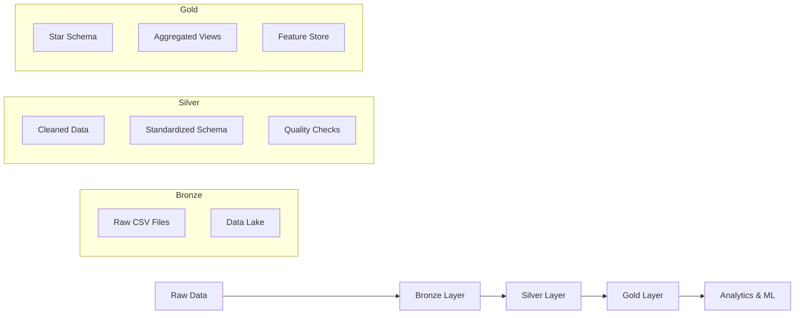

# Data Warehouse

This page provides documentation for our dbt-based data warehouse implementation using DuckDB.

## dbt Documentation

The complete dbt documentation including data lineage, model definitions, and tests is available here:

**[📊 View dbt Documentation](assets/dbt/index.html)** *(opens in new tab)*

## Data Lineage

Our data warehouse follows a medallion architecture with bronze, silver, and gold layers:


### Data Flow



## Models Overview

### Bronze Layer
- **Purpose**: Raw data ingestion and basic cleaning
- **Format**: Parquet files in DuckDB
- **Schema**: Source system schemas preserved

### Silver Layer  
- **Purpose**: Standardized, cleaned, and validated data
- **Format**: DuckDB tables with enforced schemas
- **Quality**: Great Expectations validation gates

### Gold Layer
- **Purpose**: Business-ready dimensional models
- **Format**: Star schema optimized for analytics
- **Usage**: Powers ML models and reporting

## Quality Gates

Our dbt pipeline includes comprehensive quality gates:

- **Freshness SLOs**: Data must be updated within critical thresholds
- **Data Quality Tests**: Automated validation on every dbt run
- **Schema Evolution**: Controlled schema changes with version tracking
- **Lineage Tracking**: Full end-to-end data lineage documentation

## Running dbt Locally

```bash
# Generate and view documentation
make dbt.docs

# Run models
make dbt.run

# Run tests
make dbt.test

# Complete pipeline
make pipeline.local
```

## Production Deployment

In production, our dbt models are executed via:

- **Orchestration**: Prefect/Airflow workflows
- **Compute**: Auto-scaling containers
- **Storage**: Cloud data warehouse (BigQuery/Redshift)
- **Monitoring**: Real-time freshness and quality monitoring

## Data Quality Metrics

Key quality metrics tracked across all layers:

| Metric | Bronze | Silver | Gold |
|--------|--------|--------|------|
| Completeness | 85%+ | 95%+ | 99%+ |
| Uniqueness | N/A | 100% | 100% |
| Validity | Basic | Strict | Strict |
| Freshness | 1 hour | 2 hours | 4 hours |

## Schema Documentation

Detailed schema documentation including column descriptions, data types, and business logic is available in the [dbt documentation](assets/dbt/index.html).