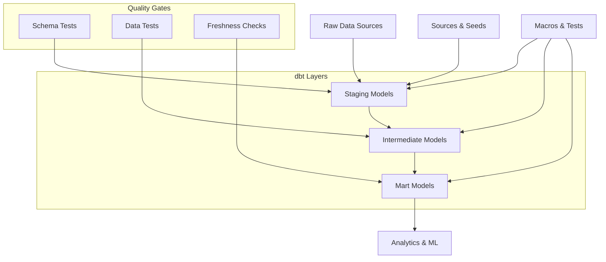

# dbt Documentation

The Clinical Data Platform uses dbt (data build tool) for SQL-based data transformations, creating analytics-ready tables from raw clinical data.

## Architecture



## Project Structure

```
dbt/
├── dbt_project.yml           # Project configuration
├── profiles.yml              # Connection profiles
├── models/
│   ├── staging/              # Clean & standardize raw data
│   │   ├── _sources.yml      # Source definitions
│   │   ├── stg_patients.sql
│   │   ├── stg_visits.sql
│   │   └── stg_conditions.sql
│   ├── intermediate/         # Business logic transformations
│   │   ├── int_patient_visits.sql
│   │   └── int_condition_rollups.sql
│   └── marts/               # Analytics-ready tables
│       ├── dim_patients.sql
│       ├── fact_visits.sql
│       └── fact_conditions.sql
├── macros/                  # Reusable SQL functions
│   ├── generate_schema_name.sql
│   └── clinical_calculations.sql
├── tests/                   # Custom data tests
│   └── assert_visit_dates.sql
├── seeds/                   # Reference data
│   ├── concept_mappings.csv
│   └── valid_codes.csv
└── snapshots/              # Slowly changing dimensions
    └── patients_snapshot.sql
```

## Source Configuration

### Raw Data Sources

```yaml
# models/staging/_sources.yml
version: 2

sources:
  - name: clinical_raw
    description: "Raw clinical data from OMOP CDM"
    database: clinical_db
    schema: raw
    
    tables:
      - name: person
        description: "Patient demographics from OMOP person table"
        columns:
          - name: person_id
            description: "Unique patient identifier"
            tests:
              - not_null
              - unique
          - name: gender_concept_id
            description: "Gender concept from OMOP vocabulary"
          - name: year_of_birth
            description: "Year of birth"
            tests:
              - not_null
        
        freshness:
          warn_after: {count: 12, period: hour}
          error_after: {count: 24, period: hour}
          
      - name: visit_occurrence
        description: "Patient visits/encounters"
        columns:
          - name: visit_occurrence_id
            tests:
              - not_null
              - unique
          - name: person_id
            tests:
              - not_null
              - relationships:
                  to: source('clinical_raw', 'person')
                  field: person_id
                  
      - name: condition_occurrence
        description: "Patient conditions/diagnoses"
        columns:
          - name: condition_occurrence_id
            tests:
              - not_null
              - unique
```

## Staging Models

Staging models clean and standardize raw data:

### Patient Staging

```sql
-- models/staging/stg_patients.sql
{{ config(materialized='view') }}

with source_data as (
    select * from {{ source('clinical_raw', 'person') }}
),

cleaned as (
    select
        person_id,
        case 
            when gender_concept_id = 8507 then 'Male'
            when gender_concept_id = 8532 then 'Female'
            else 'Unknown'
        end as gender,
        gender_concept_id,
        year_of_birth,
        
        -- Calculate age as of current date
        {{ calculate_age('year_of_birth') }} as current_age,
        
        race_concept_id,
        ethnicity_concept_id,
        
        -- Data quality flags
        case when year_of_birth between 1900 and {{ current_year() }} 
             then true else false end as valid_birth_year,
             
        current_timestamp as _loaded_at
        
    from source_data
    where person_id is not null
)

select * from cleaned

-- Tests
{{ test_age_reasonable('current_age') }}
```

### Visit Staging

```sql
-- models/staging/stg_visits.sql
{{ config(materialized='incremental', unique_key='visit_occurrence_id') }}

with source_data as (
    select * from {{ source('clinical_raw', 'visit_occurrence') }}
),

cleaned as (
    select
        visit_occurrence_id,
        person_id,
        visit_concept_id,
        
        -- Standardize visit types
        case visit_concept_id
            when 9202 then 'Outpatient'
            when 9201 then 'Inpatient'
            when 9203 then 'Emergency'
            else 'Other'
        end as visit_type,
        
        visit_start_date,
        visit_end_date,
        
        -- Calculate visit duration
        case 
            when visit_end_date is not null 
            then datediff('day', visit_start_date, visit_end_date)
            else null
        end as visit_duration_days,
        
        -- Data quality checks
        case when visit_end_date >= visit_start_date or visit_end_date is null
             then true else false end as valid_date_range,
             
        current_timestamp as _loaded_at
        
    from source_data
    where visit_occurrence_id is not null
      and person_id is not null
)

select * from cleaned


    where _loaded_at > (select max(_loaded_at) from {{ this }})

```

## Intermediate Models

Intermediate models apply business logic:

### Patient Visit Summary

```sql
-- models/intermediate/int_patient_visits.sql
{{ config(materialized='table') }}

with patient_visits as (
    select
        p.person_id,
        p.gender,
        p.current_age,
        v.visit_occurrence_id,
        v.visit_type,
        v.visit_start_date,
        v.visit_duration_days
    from {{ ref('stg_patients') }} p
    join {{ ref('stg_visits') }} v on p.person_id = v.person_id
    where p.valid_birth_year = true
      and v.valid_date_range = true
),

visit_summary as (
    select
        person_id,
        gender,
        current_age,
        
        -- Visit counts by type
        count(*) as total_visits,
        sum(case when visit_type = 'Inpatient' then 1 else 0 end) as inpatient_visits,
        sum(case when visit_type = 'Outpatient' then 1 else 0 end) as outpatient_visits,
        sum(case when visit_type = 'Emergency' then 1 else 0 end) as emergency_visits,
        
        -- Visit timing
        min(visit_start_date) as first_visit_date,
        max(visit_start_date) as last_visit_date,
        
        -- Average visit duration (for inpatient stays)
        avg(case when visit_type = 'Inpatient' and visit_duration_days > 0 
                 then visit_duration_days end) as avg_inpatient_duration,
                 
        current_timestamp as _transformed_at
        
    from patient_visits
    group by person_id, gender, current_age
)

select * from visit_summary
```

## Mart Models

Final analytics-ready tables:

### Patient Dimension

```sql
-- models/marts/dim_patients.sql
{{ config(
    materialized='table',
    indexes=[
        {'columns': ['person_id'], 'unique': true},
        {'columns': ['gender', 'age_group']},
    ]
) }}

with patient_base as (
    select * from {{ ref('stg_patients') }}
),

visit_summary as (
    select * from {{ ref('int_patient_visits') }}
),

final as (
    select
        p.person_id,
        p.gender,
        p.current_age,
        
        -- Age groupings for analytics
        case 
            when p.current_age < 18 then 'Pediatric'
            when p.current_age between 18 and 64 then 'Adult'  
            when p.current_age >= 65 then 'Senior'
            else 'Unknown'
        end as age_group,
        
        case
            when p.current_age between 18 and 24 then '18-24'
            when p.current_age between 25 and 34 then '25-34'
            when p.current_age between 35 and 44 then '35-44'
            when p.current_age between 45 and 54 then '45-54'
            when p.current_age between 55 and 64 then '55-64'
            when p.current_age >= 65 then '65+'
            else 'Under 18'
        end as age_bucket,
        
        p.year_of_birth,
        p.race_concept_id,
        p.ethnicity_concept_id,
        
        -- Visit summary metrics
        coalesce(v.total_visits, 0) as total_visits,
        coalesce(v.inpatient_visits, 0) as inpatient_visits,
        coalesce(v.outpatient_visits, 0) as outpatient_visits,
        coalesce(v.emergency_visits, 0) as emergency_visits,
        
        v.first_visit_date,
        v.last_visit_date,
        
        -- Patient categorization
        case 
            when v.total_visits = 0 then 'No visits'
            when v.total_visits = 1 then 'Single visit'
            when v.total_visits between 2 and 5 then 'Low utilization'
            when v.total_visits between 6 and 15 then 'Medium utilization'
            else 'High utilization'
        end as utilization_category,
        
        -- Recency indicators
        case when v.last_visit_date >= current_date - interval '90 days'
             then true else false end as recent_patient,
             
        current_timestamp as _loaded_at
        
    from patient_base p
    left join visit_summary v on p.person_id = v.person_id
    where p.valid_birth_year = true
)

select * from final
```

### Visit Fact Table

```sql
-- models/marts/fact_visits.sql
{{ config(
    materialized='incremental',
    unique_key='visit_occurrence_id',
    on_schema_change='append_new_columns'
) }}

with visits as (
    select * from {{ ref('stg_visits') }}
),

patients as (
    select person_id, gender, age_group, age_bucket 
    from {{ ref('dim_patients') }}
),

final as (
    select
        v.visit_occurrence_id,
        v.person_id,
        p.gender,
        p.age_group,
        p.age_bucket,
        
        v.visit_type,
        v.visit_start_date,
        v.visit_end_date,
        v.visit_duration_days,
        
        -- Date dimensions
        extract(year from v.visit_start_date) as visit_year,
        extract(month from v.visit_start_date) as visit_month,
        extract(dow from v.visit_start_date) as visit_day_of_week,
        
        -- Visit categorization
        case 
            when v.visit_duration_days = 0 then 'Same day'
            when v.visit_duration_days = 1 then 'Overnight'
            when v.visit_duration_days between 2 and 7 then 'Short stay'
            when v.visit_duration_days > 7 then 'Long stay'
            else 'Unknown duration'
        end as duration_category,
        
        current_timestamp as _loaded_at
        
    from visits v
    join patients p on v.person_id = p.person_id
    where v.valid_date_range = true
)

select * from final


    where _loaded_at > (select max(_loaded_at) from {{ this }})

```

## Macros

Reusable SQL functions:

```sql
-- macros/clinical_calculations.sql

{# Calculate age from year of birth #}

    extract(year from current_date) - {{ birth_year_column }}


{# Get current year #}

    extract(year from current_date)


{# Test for reasonable age values #}

    select count(*)
    from {{ this }}
    where {{ column_name }} < 0 or {{ column_name }} > 120


{# Generate standardized patient cohorts #}

    select distinct person_id
    from {{ ref('fact_visits') }}
    where visit_start_date between '{{ start_date }}' and '{{ end_date }}'
    
    
        and person_id in (
            select person_id from {{ ref('fact_conditions') }}
            where condition_name in ({{ conditions | join(', ') }})
        )
    

```

## Tests & Quality

### Schema Tests

```yaml
# models/marts/schema.yml
version: 2

models:
  - name: dim_patients
    description: "Patient dimension table with demographics and visit summary"
    tests:
      - dbt_utils.unique_combination_of_columns:
          combination_of_columns:
            - person_id
    columns:
      - name: person_id
        description: "Unique patient identifier"
        tests:
          - unique
          - not_null
      - name: age_group
        description: "Age category grouping"
        tests:
          - accepted_values:
              values: ['Pediatric', 'Adult', 'Senior', 'Unknown']
      - name: utilization_category  
        description: "Patient utilization pattern"
        tests:
          - not_null
          
  - name: fact_visits
    description: "Visit fact table with patient and temporal dimensions"
    tests:
      # Ensure visit dates are logical
      - dbt_expectations.expect_column_pair_values_A_to_be_greater_than_B:
          column_A: visit_end_date
          column_B: visit_start_date
          or_equal: true
    columns:
      - name: visit_occurrence_id
        tests:
          - unique
          - not_null
      - name: person_id
        tests:
          - not_null
          - relationships:
              to: ref('dim_patients')
              field: person_id
```

### Custom Tests

```sql
-- tests/assert_patient_age_reasonable.sql
-- Ensure all patients have reasonable ages

select person_id, current_age
from {{ ref('dim_patients') }}
where current_age < 0 or current_age > 120
```

### dbt Expectations

```yaml
# Enhanced testing with dbt-expectations
models:
  - name: dim_patients
    tests:
      # Row count checks
      - dbt_expectations.expect_table_row_count_to_be_between:
          min_value: 1000
          max_value: 100000
          
      # Data distribution tests
      - dbt_expectations.expect_column_values_to_be_in_set:
          column_name: gender
          value_set: ['Male', 'Female', 'Unknown']
          
      # Statistical tests  
      - dbt_expectations.expect_column_mean_to_be_between:
          column_name: current_age
          min_value: 35
          max_value: 65
          
      # Uniqueness tests
      - dbt_expectations.expect_compound_columns_to_be_unique:
          column_list: ['person_id']
```

## Snapshots

Track slowly changing dimensions:

```sql
-- snapshots/patients_snapshot.sql

    {{
        config(
          target_schema='snapshots',
          unique_key='person_id',
          strategy='timestamp',
          updated_at='_loaded_at',
        )
    }}
    
    select * from {{ ref('stg_patients') }}
    

```

## Exposures

Document downstream consumers:

```yaml
# models/exposures.yml
version: 2

exposures:
  - name: clinical_dashboard
    type: dashboard
    url: https://grafana.clinical-platform.com/dashboard/clinical
    description: "Main clinical analytics dashboard"
    depends_on:
      - ref('dim_patients')
      - ref('fact_visits')
      - ref('fact_conditions')
    owner:
      name: "Data Team"
      email: "data@clinical-platform.com"
      
  - name: ml_risk_model
    type: ml
    description: "Clinical risk prediction model"
    depends_on:
      - ref('dim_patients')
      - ref('fact_visits')
    owner:
      name: "ML Team"
      email: "ml@clinical-platform.com"
      
  - name: api_endpoints
    type: application
    url: https://api.clinical-platform.com/docs
    description: "REST API for patient and visit data"
    depends_on:
      - ref('dim_patients')
      - ref('fact_visits')
    owner:
      name: "Engineering Team"
      email: "eng@clinical-platform.com"
```

## Deployment

### Development Workflow

```bash
# Install dependencies
pip install dbt-duckdb

# Set up profiles
dbt debug

# Development cycle
dbt compile                # Check SQL syntax
dbt run --select stg_*     # Run staging models
dbt test --select stg_*    # Test staging models
dbt run                    # Run all models
dbt test                   # Run all tests

# Documentation
dbt docs generate          # Generate documentation
dbt docs serve            # Serve docs locally
```

### Production Deployment

```bash
# Full refresh for major changes
dbt run --full-refresh

# Incremental run for daily updates  
dbt run --select state:modified+

# Test with failure storage
dbt test --store-failures

# Source freshness checks
dbt source freshness

# Generate updated docs
dbt docs generate
```

## Performance Optimization

### Incremental Models

```sql
-- Optimized incremental configuration
{{ config(
    materialized='incremental',
    unique_key='visit_occurrence_id',
    on_schema_change='append_new_columns',
    incremental_strategy='merge'
) }}

-- Incremental logic

    where visit_start_date > (
        select max(visit_start_date) from {{ this }}
    )

```

### Partitioning

```sql
-- Date partitioned table
{{ config(
    materialized='table',
    partition_by=['visit_year', 'visit_month']
) }}
```

### Indexing

```sql
-- Optimized indexes for query performance
{{ config(
    indexes=[
        {'columns': ['person_id'], 'unique': true},
        {'columns': ['visit_start_date']},
        {'columns': ['gender', 'age_group']},
    ]
) }}
```