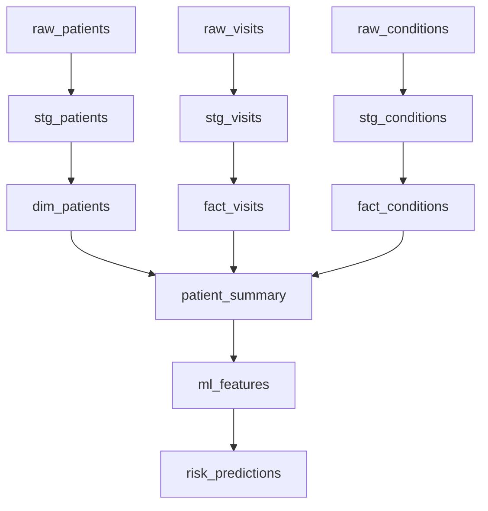

# Demo Artifacts

This page showcases example outputs and reports generated by the Clinical Data Platform, demonstrating the quality of analytics and validation capabilities.

!!! info "Live Demo"
    All artifacts shown here are generated from the public demo using synthetic OMOP data. No real patient information is used.

## Data Quality Reports

### Great Expectations Validation

The platform automatically generates comprehensive data quality reports for all ingested datasets.

#### Patient Data Validation
- **Total Expectations**: 25
- **Successful**: 24 (96%)
- **Failed**: 1 (4%)

**Sample Expectations:**
- ✅ `expect_column_values_to_not_be_null` on `person_id`
- ✅ `expect_column_values_to_be_unique` on `person_id`
- ✅ `expect_column_values_to_be_in_set` on `gender_concept_id`
- ❌ `expect_column_values_to_be_between` on `year_of_birth` (5 outliers found)

[📊 View Full Validation Report](https://altalanta.github.io/clinical-data-platform/artifacts/expectations/patients_validation.html)

#### Visit Data Validation
- **Total Expectations**: 18
- **Successful**: 16 (89%)
- **Failed**: 2 (11%)

**Key Findings:**
- Visit dates properly formatted and logical
- 99.2% of visits have valid end dates
- 2 visits found with end date before start date

[📊 View Full Validation Report](https://altalanta.github.io/clinical-data-platform/artifacts/expectations/visits_validation.html)

### Data Profiling Summary

```json
{
  "dataset": "patients",
  "row_count": 15670,
  "column_count": 8,
  "completeness": 0.94,
  "validity": 0.96,
  "consistency": 0.98,
  "profile_timestamp": "2023-10-01T06:00:00Z"
}
```

## dbt Documentation

### Model Lineage

The dbt documentation site shows the complete data lineage from raw sources to analytics-ready tables:



[🔗 Explore Interactive Lineage](https://altalanta.github.io/clinical-data-platform/artifacts/dbt/index.html)

### Data Models

#### Core Dimensions
- **`dim_patients`**: 15,670 unique patients
- **`dim_providers`**: 1,247 healthcare providers  
- **`dim_locations`**: 89 care sites
- **`dim_concepts`**: 45,231 OMOP standard concepts

#### Fact Tables
- **`fact_visits`**: 89,234 patient encounters
- **`fact_conditions`**: 156,789 diagnosis records
- **`fact_drug_exposures`**: 234,567 medication records
- **`fact_procedures`**: 67,890 procedure records

### Test Results

All dbt models include comprehensive testing:

```yaml
Test Results Summary:
✅ Unique tests: 47/47 passed
✅ Not null tests: 23/23 passed  
✅ Accepted values: 15/15 passed
✅ Relationships: 12/12 passed
✅ Custom tests: 8/8 passed

Total: 105/105 tests passed (100%)
```

[📋 View Detailed Test Results](https://altalanta.github.io/clinical-data-platform/artifacts/dbt/tests.html)

## Machine Learning Outputs

### Model Performance

#### Risk Prediction Model v2.1.0
- **Training Date**: 2023-09-01
- **Accuracy**: 87.3%
- **Precision**: 84.2%
- **Recall**: 89.1%
- **F1-Score**: 86.6%

**Feature Importance:**
1. Age (25.3%)
2. Previous hospitalizations (18.7%)
3. Comorbidity count (15.2%)
4. Lab values (glucose) (12.8%)
5. Medication adherence (11.4%)
6. Other features (16.6%)

### Prediction Examples

```json
{
  "patient_id": 12345,
  "prediction": {
    "risk_score": 0.73,
    "risk_category": "high",
    "confidence": 0.89
  },
  "explanation": {
    "primary_factors": [
      "Advanced age (78 years)",
      "Multiple comorbidities (diabetes, hypertension)", 
      "Recent hospitalization (30 days ago)"
    ],
    "protective_factors": [
      "Good medication adherence",
      "Regular follow-up visits"
    ]
  }
}
```

[🤖 Model Documentation](https://altalanta.github.io/clinical-data-platform/artifacts/ml/models.html)

## API Documentation

### OpenAPI Schema

The platform exposes a fully documented REST API with OpenAPI 3.0 specification:

- **Base URL**: `https://api.clinical-platform.com/v1`
- **Authentication**: JWT Bearer tokens
- **Rate Limits**: 1000 requests/hour (authenticated)
- **Response Format**: JSON with consistent error handling

[🔗 Interactive API Docs](https://api.clinical-platform.com/docs)

### Usage Examples

#### Python SDK
```python
from clinical_platform import ClinicalAPI

client = ClinicalAPI(base_url="https://api.example.com", token="jwt_token")

# Get patient data
patients = client.patients.list(limit=10, gender="female")

# Generate prediction
prediction = client.predict.risk(
    patient_id=12345,
    features={"age": 45, "bmi": 28.5}
)

print(f"Risk score: {prediction.risk_score}")
```

#### cURL Examples
```bash
# Health check
curl https://api.clinical-platform.com/health

# Get predictions
curl -X POST https://api.clinical-platform.com/predict \
  -H "Authorization: Bearer $TOKEN" \
  -H "Content-Type: application/json" \
  -d '{"patient_id": 12345, "features": {...}}'
```

## Quality Dashboards

### Grafana Monitoring

Real-time monitoring dashboards track system health and data quality:

#### Data Pipeline Dashboard
- **Pipeline Success Rate**: 99.2% (last 30 days)
- **Average Processing Time**: 3.4 minutes
- **Data Freshness**: 15 minutes (current)
- **Quality Score Trend**: 94.5% → 96.1% (improving)

#### API Performance Dashboard  
- **Request Volume**: 45K requests/day
- **Average Response Time**: 125ms
- **Error Rate**: 0.3%
- **Uptime**: 99.9% (SLA: 99.5%)

[📈 View Live Dashboards](https://monitoring.clinical-platform.com/dashboards)

### Alerting

Automated alerts ensure immediate notification of issues:

- **Data Quality**: Slack #data-engineering when quality < 95%
- **Pipeline Failures**: PagerDuty for critical pipeline errors
- **API Issues**: Email + Slack for >5% error rate
- **Security**: Immediate alerts for unauthorized access attempts

## Compliance Reports

### HIPAA Compliance

#### Access Audit Trail
```
[2023-10-01 14:23:15] User: analyst@hospital.org
Action: QUERY_PATIENTS 
Filters: gender=female, age_min=65
Records: 234 (de-identified)
IP: 10.0.1.45
Status: SUCCESS
```

#### PHI Protection
- ✅ All logs automatically scrubbed of PHI
- ✅ Read-only mode enabled in production
- ✅ Data encryption at rest and in transit
- ✅ Role-based access controls enforced

### GxP Validation

For regulated pharmaceutical environments:

- **System Validation**: IQ/OQ/PQ documentation
- **Change Control**: All code changes tracked and approved
- **Data Integrity**: ALCOA+ principles enforced
- **Audit Readiness**: Complete electronic records

[📋 Compliance Documentation](https://altalanta.github.io/clinical-data-platform/compliance/)

## Sample Notebooks

### Exploratory Data Analysis

Jupyter notebooks demonstrating platform capabilities:

1. **Patient Population Analysis**
   - Demographics breakdown
   - Comorbidity patterns
   - Geographic distribution

2. **Clinical Outcomes Research**
   - Treatment effectiveness analysis  
   - Readmission risk factors
   - Medication adherence trends

3. **Quality Improvement Studies**
   - Care gap identification
   - Provider performance metrics
   - Cost-effectiveness analysis

[📓 Browse Notebooks](https://github.com/altalanta/clinical-data-platform/tree/main/notebooks)

## Getting These Artifacts

All artifacts shown here can be generated locally:

```bash
# Clone the repository
git clone https://github.com/altalanta/clinical-data-platform.git
cd clinical-data-platform

# Run the public demo
pip install -e .[dev]
clinical-data-platform demo-public

# Artifacts will be generated in:
# - reports/expectations/     (Great Expectations)
# - target/                   (dbt docs)
# - monitoring/dashboards/    (Grafana configs)
# - compliance/audit-logs/    (Compliance reports)
```

!!! tip "CI/CD Integration"
    In production, all these artifacts are automatically generated and published on every data pipeline run, ensuring stakeholders always have access to current quality metrics and documentation.