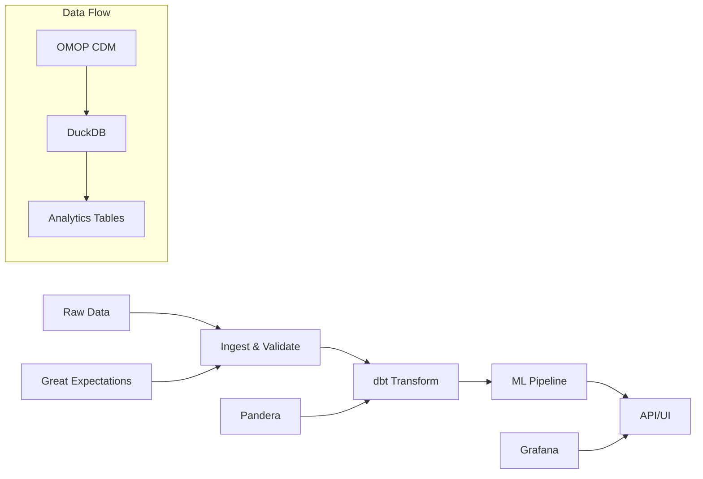

# Clinical Data Platform

[](https://github.com/altalanta/clinical-data-platform/actions/workflows/ci.yml)
[](https://altalanta.github.io/clinical-data-platform/)
[](https://github.com/altalanta/clinical-data-platform/pkgs/container/clinical-data-platform)

**Local-first clinical data platform**: ingest → transform (dbt/DuckDB) → validate → ML → API/UI

## Key Features

!!! success "Production Ready"
    
    - **🔒 HIPAA/GxP Compliant**: Read-only mode, PHI scrubbing, audit trails
    - **📊 Analytics-Ready**: dbt transformations with DuckDB backend
    - **✅ Quality Assured**: Great Expectations + Pandera validation
    - **🚀 API-First**: FastAPI with OpenAPI schema generation
    - **📈 Observable**: Grafana dashboards and OpenTelemetry
    - **🧪 Tested**: Property-based API testing with Schemathesis

## Architecture Overview



## Quick Start

### 🎲 Public Demo (No PHI)

Try the platform instantly with synthetic data:

=== "Local"

    ```bash
    git clone https://github.com/altalanta/clinical-data-platform.git
    cd clinical-data-platform
    pip install -e .[dev]
    clinical-data-platform demo-public
    ```

=== "Codespaces"

    [](https://codespaces.new/altalanta/clinical-data-platform?quickstart=1)

=== "Google Colab"

    [](https://colab.research.google.com/github/altalanta/clinical-data-platform/blob/main/notebooks/public_demo_quickstart.ipynb)

### 🏥 Production Setup

For production deployments with real clinical data:

```bash
# Deploy with Docker
docker run -d \
  -e READ_ONLY_MODE=1 \
  -e LOG_SCRUB_VALUES=1 \
  -p 8000:8000 \
  ghcr.io/altalanta/clinical-data-platform:latest

# Or use the CLI
clinical-data-platform api --read-only
```

## What You Get

### 📊 Analytics & Reporting
- **dbt models** for clinical analytics
- **DuckDB** for fast analytical queries  
- **Jupyter notebooks** for exploratory analysis
- **Grafana dashboards** for monitoring

### ✅ Data Quality
- **Great Expectations** for data profiling
- **Pandera** for schema validation
- **Automated quality gates** in CI/CD
- **Quality reports** and documentation

### 🔒 Compliance & Security
- **Read-only mode** for production safety
- **PHI scrubbing** in logs and exports
- **Audit trails** for all data access
- **Security scanning** with CodeQL and Bandit

### 🚀 Developer Experience
- **FastAPI** with automatic OpenAPI docs
- **Type hints** throughout the codebase
- **Property-based testing** with Schemathesis
- **Pre-commit hooks** for code quality

## Use Cases

!!! example "Research & Analytics"
    
    - Population health studies
    - Clinical trial analysis
    - Quality improvement initiatives
    - Regulatory reporting

!!! example "Machine Learning"
    
    - Predictive modeling
    - Risk stratification
    - Clinical decision support
    - Automated quality checks

!!! example "Integration & APIs"
    
    - EMR integration
    - Real-time dashboards
    - Mobile applications
    - Third-party analytics tools

## Next Steps

- **[Getting Started](getting-started.md)** - Installation and basic usage
- **[Architecture](architecture.md)** - System design and components
- **[Data Flow](data-flow.md)** - How data moves through the platform
- **[API Reference](api.md)** - REST API documentation
- **[Demo Artifacts](demo-artifacts.md)** - Example outputs and reports

## Support

- **Documentation**: [https://altalanta.github.io/clinical-data-platform/](https://altalanta.github.io/clinical-data-platform/)
- **Issues**: [GitHub Issues](https://github.com/altalanta/clinical-data-platform/issues)
- **Discussions**: [GitHub Discussions](https://github.com/altalanta/clinical-data-platform/discussions)
